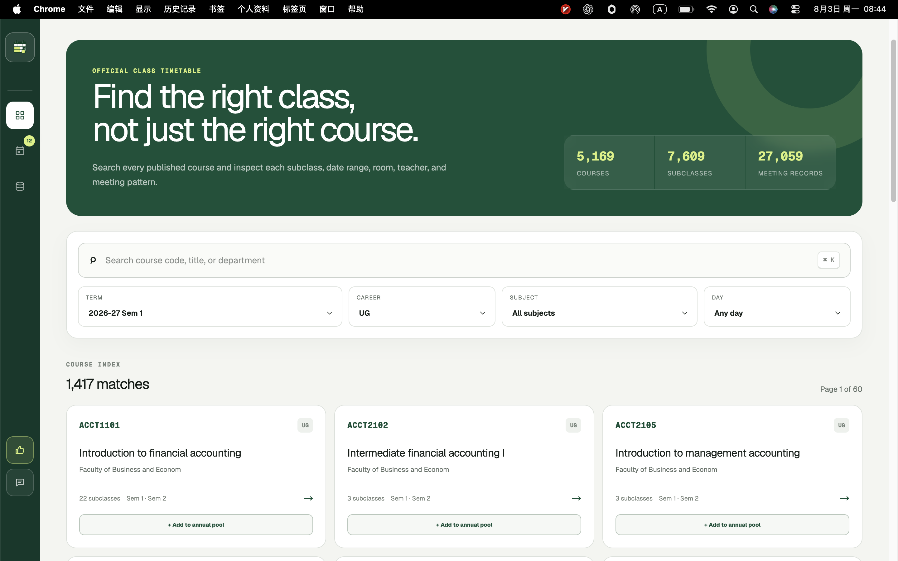
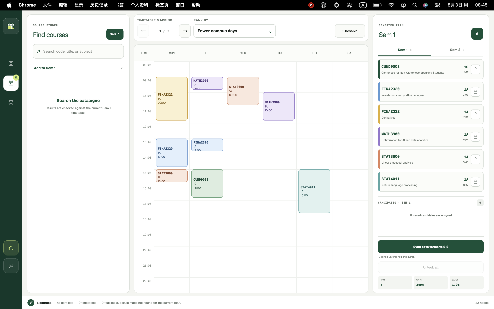
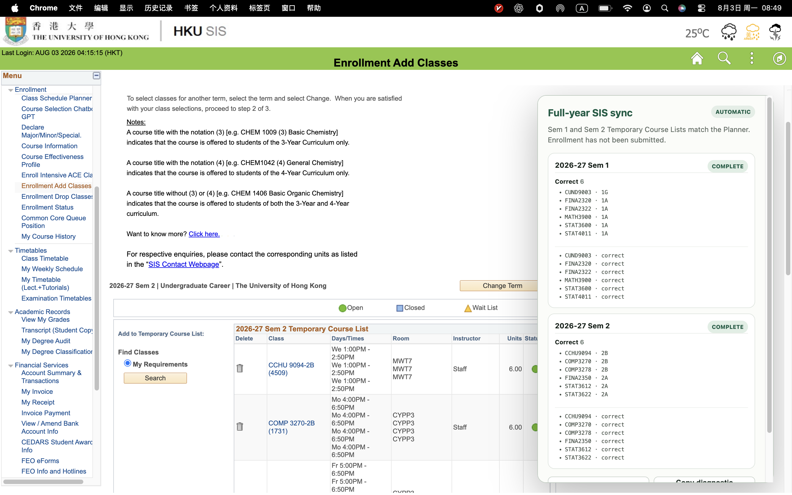
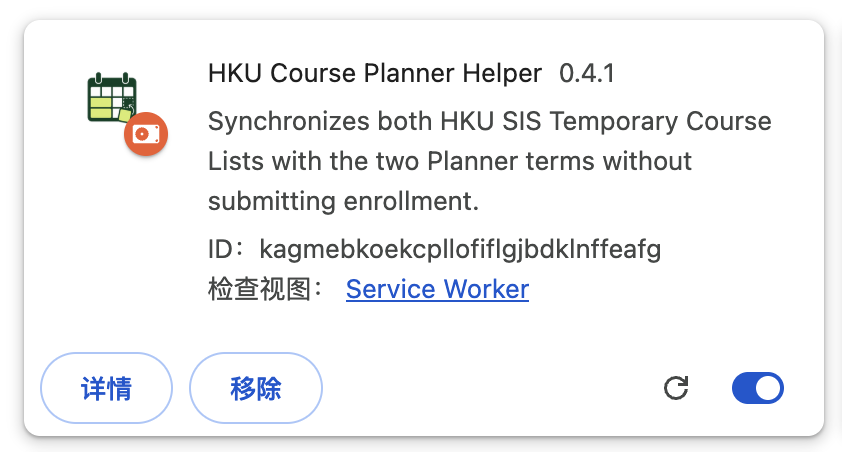
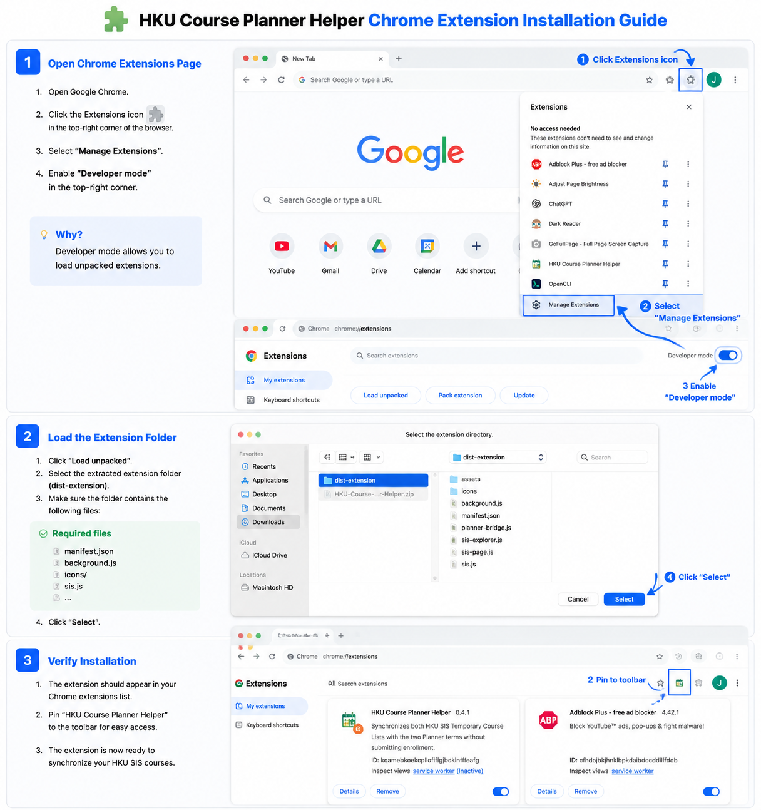

# HKU Course Planner

> 🌐 Try it now: https://hku-planner.mjxw05.chatgpt.site/

<p align="center">
  
</p>

<p align="center">
  An intelligent course planning assistant for HKU students.
  <br/>
  Plan your courses, visualize your schedule, and synchronize with HKU SIS automatically.
</p>

---

> ⚠️ **Important:** Please use the Chrome extension zip file provided in this repository instead of the version shown on the website.  
> Installation guide: [Browser Extension](#-browser-extension)

---

## Overview

HKU Course Planner is an intelligent course planning tool designed to simplify the course selection process for students at The University of Hong Kong.

Instead of manually searching through courses, comparing subclasses, and checking timetable conflicts, students can organize their course plans in one place, visualize their schedules, and synchronize their selections with HKU SIS through a browser extension.

The goal is to transform course selection from a repetitive manual process into a streamlined and automated workflow.

---

## Screenshots

### 🏠 Home Page

The home page provides a centralized workspace for managing your course plan.

Students can organize selected courses, view course information, and prepare their semester schedule before enrollment.



---

### 🗓️ Course Schedule Planner

The schedule planner provides an interactive calendar view of your planned courses.

It helps students:

- Visualize weekly timetables
- Compare different course combinations
- Identify schedule conflicts
- Plan a balanced semester workload



---

## Features

### 📚 Course Planning

- Organize courses and subclasses in one workspace
- View important course information:
  - Course code
  - Course title
  - Class number
  - Schedule
  - Credits
- Build semester plans before official enrollment

---

### 🔄 HKU SIS Synchronization

The browser extension connects your course plan with the HKU SIS system.

It can:

- Read current SIS temporary course selections
- Compare SIS status with your planned courses
- Detect differences:
  - Missing courses
  - Incorrect subclasses
  - Extra courses
- Automatically synchronize your planned schedule with SIS



---

### 🧩 Browser Extension

HKU Course Planner includes a companion Chrome extension for SIS automation.

The extension provides:

- Automated course searching
- Course adding workflow
- Subclass replacement
- Difference-based synchronization
- Real-time execution status



---

### 📦 Extension Installation

The extension can be installed locally using the Chrome extension package provided in this repository.

Installation workflow:

1. Download the extension zip file from this repository.
2. Extract the zip file.
3. Open Chrome Extensions page.
4. Enable **Developer Mode**.
5. Select **Load unpacked**.
6. Choose the extracted extension folder.



---

## How It Works

```
Course Plan
      |
      v
Schedule Analysis
      |
      v
Compare With HKU SIS
      |
      v
Detect Differences
      |
      v
Synchronize Courses
      |
      v
Updated SIS Temporary Course List
```

The system compares your desired course plan with your current SIS state and only performs the required operations.

---

## Motivation

Course selection often requires students to:

- Search courses manually
- Check multiple subclasses
- Compare timetable conflicts
- Repeat the same workflow every semester

HKU Course Planner reduces this friction by providing a unified planning and synchronization workflow.

---

## Tech Stack

### Frontend

- React
- TypeScript

### Browser Extension

- TypeScript
- Chrome Extension APIs

### Core Technologies

- Course data processing
- Schedule conflict detection
- Browser automation
- SIS workflow integration

---

## Project Status

🚧 Actively developing

Current features:

- ✅ Course planning workspace
- ✅ Interactive calendar scheduling
- ✅ Timetable visualization
- ✅ HKU SIS synchronization
- ✅ Browser automation workflow

Future improvements:

- AI-assisted course recommendations
- Workload analysis
- Graduation requirement tracking
- Multi-semester academic planning

---

## Demo

🌐 https://hku-planner.mjxw05.chatgpt.site/

---

## Disclaimer

This project is an independent student project and is not affiliated with The University of Hong Kong.

Users should always verify their final course selections before official enrollment submission.
